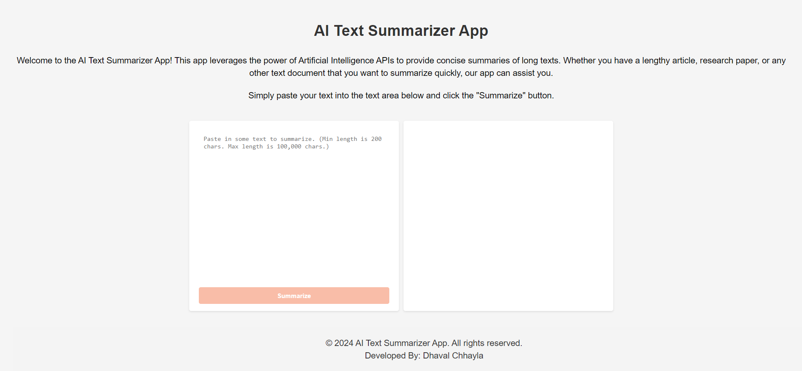
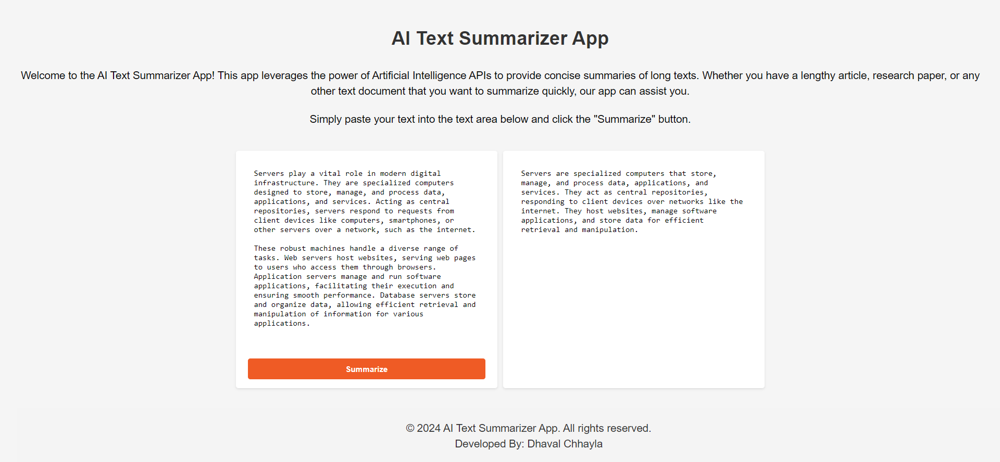

# AI Text Summarizer App
This app leverages the power of Artificial Intelligence APIs to provide concise summaries of long texts. Whether you have a lengthy article, research paper, or any other text document that you want to summarize quickly.

## Screenshots

<table>
  <tr>
    <td></td>
  </tr>
  <tr>
    <td></td>
  </tr>
</table>

## Technologies/Libraries Used

- HTML,CSS,Javascript
- Hugging Face API
- ReScript,Nix 

## Features

- The user can submit their text with a “summarize” button and receive an AI-powered summary in an output textarea.

## Installation

1. Clone the repository.
2. Open the project in Replit.
3. Build and run the app on a WebView.

## Contributing Guidelines

- Report any issues using the GitHub issue tracker.
- Feel free to fork the repository and submit pull requests for new features or bug fixes.

## License

This project is licensed under the MIT License - see the [LICENSE.md](LICENSE.md) file for details.

## Contact

For questions or feedback, contact Dhaval Chhayla at dhavalhchhayla@gmail.com.
